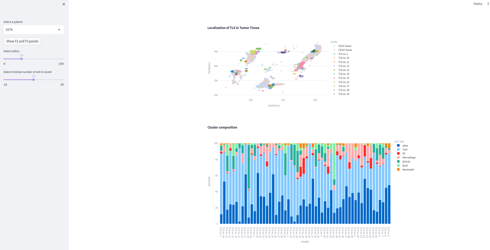

# Streamlit Tumor Spatial Data Visualization App

This Streamlit application is designed to provide an interactive visualization of tumor spatial data. It focuses on the immunologic environment from biopsy samples, allowing users to gain insights into the cellular composition and interactions within the tumor microenvironment. One of the key features of this application is the ability to select specific cell types for visualization, providing a more tailored and detailed view of the data. 

